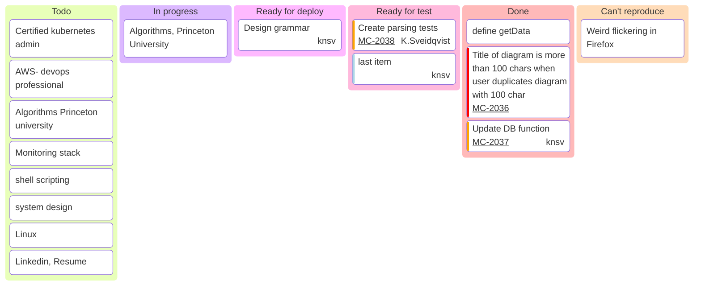
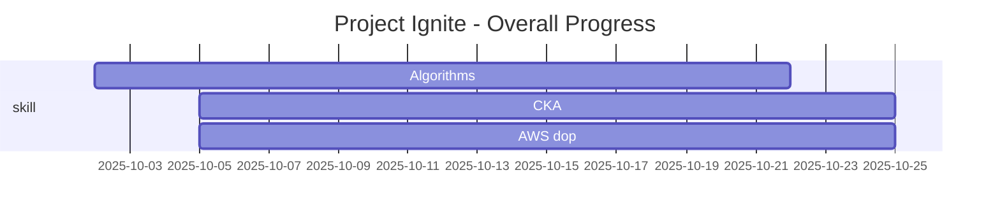

I Foundation & Materials
Skills audit
Target list
Resume revamp
linkedin overhaul

---
II Skill Demonstration & Project 
Select Project 
Phase 1 --> IAC
Phase 2 --> Containerization
Phase 3 --> CI/CD
Phase 4 --> Documentation

---
III Job hunt , networking
Weekly Application Goal
Recruiter Outreach List
Strategic LinkedIn Networking
Meetup Engagement

---
IV
Prepare Your "Story": Write down and practice a 60-second explanation of your career journey, the employment gap (frame it positively as a skill-building period), and why you're excited to return to work.
Behavioral Questions
Technical Refresh

---

Your Weekly Action Plan
Track using go for it

Mondays & Tuesdays (9am-1pm): Deep Work
Focus on your Project or Skill-Building. No distractions.

Wednesdays & Thursdays (9am-1pm): Active Hunting
Focus on Job Applications and Tailoring Resumes/Cover Letters.

Fridays (9am-1pm): Networking & Admin
Focus on LinkedIn Connection Requests and Application Tracking.

Weekends:
Dedicate one 2-3 hour block to either a bigger project task or complete rest. Your choice.

Use GTimeLog, time is gold, be mindful of what you spend it on :-)

